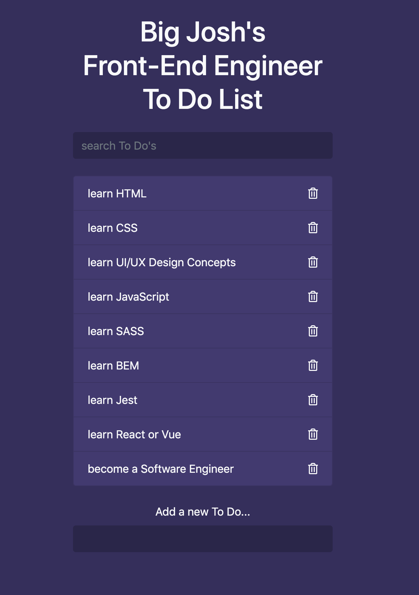

# To Do List Version 1.0

## What is it?
A To Do List App built in JavaScript

This app allows a user to create a To Do List by adding or deleting items from
that list. Also, allows a user to search for a specific item added to the list
via a search box.

### Concepts:
- Event Listeners
- Event Bubbling
- Filter method usage
- Input/Search handling

### View Here:
https://bigjoshs-frontend-todo-app.web.app/?search=lear

## Built with:
- [x] HTML
- [x] CSS
- [x] JavaScript
- [x] Bootstrapped CSS for theme

## Features:
- [x] Add New To Do Item to list
- [x] Remove existing To Do Item from list
- [x] Search for existing Item in List

## Screenshots:
#### List with existing Items
{height="50%" width="50%"}

### Roadmap for Improvement:
- List persistence (local storage)
- List Title renaming
- Make items movable/reorder feature
- Theme toggling/changing
- Exporting list

---

## Author
* Joshua S. Jimenez | [Github: jsjimenez51](https://github.com/jsjimenez51) |
  [LinkedIn: @jsjimenez51](https://www.linkedin.com/in/jsjimenez51/) | 
  [Twitter: @bigjoshcodes](https://twitter.com/bigjoshcodes)